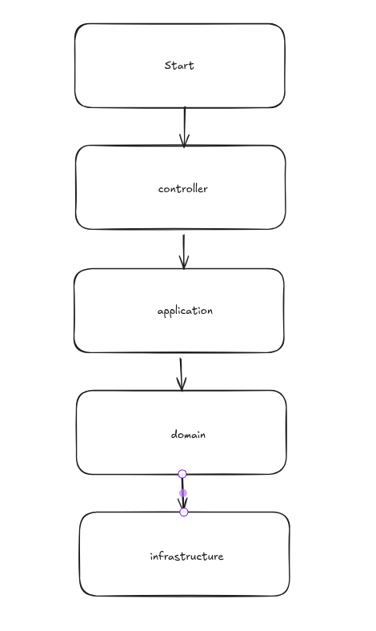

# VAI TRÒ CỦA TỪNG MODULE
## Start:
    - Khởi động dự án
    - Wiring các module

### Controller
    - Giao tiếp với thế giới bên ngoài
    - Nhận request – trả response
    - Mapping HTTP → Use Case
    - Chứa:
        + REST Controller
        + Request DTO
        + Validation cơ bản

### Application
    - Triển khai Use Case
    - Điều phối domain objects
    - Định nghĩa luồng nghiệp vụ
    - Chứa
        + Application Service / Use Case
        + Command / Query
        + DTO (Request / Response)
        + Transaction boundary

### Domain
    - Mô hình hóa nghiệp vụ
    - Đảm bảo business rule & invariant
    - Không qua tâm kĩ thuật
    - Chứa:
        + Entity
        + Aggregate Root
        + Value Object
        + Domain Service
        + Domain Event
        + Repository interface

### Infrastructure
    - Code chi tiết kỹ thuật
    - Kết nối hệ thống bên ngoài
    - Chứa:
        + JPA Entity
        + Spring Data Repository
        + DB / Cache / Messaging
        + External API Client
        + Config kỹ thuật